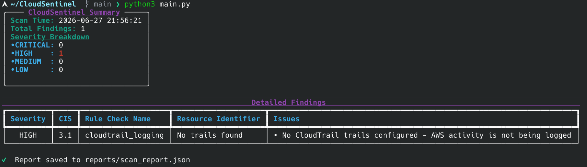

# CloudSentinel

A modular, Python-based AWS security auditing tool designed to detect misconfigurations.

## Engineering Highlights
- **Config-Driven Architecture:** Used `importlib` for dynamic plugin loading. New checks require only a scanner function and one YAML entry.
- **CLI Control:** Implemented filtering via CLI flags (`--service`, `--severity`).
- **Mock-Testing:** Implemented unit testing using `pytest` and `moto` to simulate AWS environments.
- **Improved CLI Reporting**: Refactored the output format using Rich library to provide real-time progress tracking and color-coded severity breakdowns.
- **CIS Mapping:** Every check maps to a CIS AWS Foundations Benchmark v5.0.0 control, with severity assigned from AWS Security Hub's official documentation.

## Architecture
CloudSentinel follows a modular architecture:
* `main.py` coordinates the scan, filters resources, and manages task flow.
* Independent modules in `scanners/` interact with AWS via `boto3`.
* Uses `checks.yaml` to define scan parameters, mapping specific security checks to their modules, severity levels, and CIS benchmarks.
* The `ReportGenerator` processes findings and renders them into the CLI dashboard using `Rich`.

## Sample Output


## Tech Stack
- **Core:** Python 3 
- **Cloud SDK:** `boto3`
- **Testing:** `pytest`, `moto`
- **UI/UX:** `rich`

## Prerequisites
#### IAM policies needed:
- AmazonS3ReadOnlyAccess
- IAMReadOnlyAccess
- AmazonEC2ReadOnlyAccess
- AWSCloudTrail_ReadOnlyAccess
- AmazonRDSReadOnlyAccess


## Setup
```bash
git clone https://github.com/r0shhh/CloudSentinel
cd CloudSentinel
python3 -m venv venv
source venv/bin/activate
pip install -r requirements.txt
aws configure
python3 main.py                      # run all checks
python3 main.py --service s3         # only S3 checks
python3 main.py --severity CRITICAL  # only CRITICAL findings
```

## Current Checks

| Check | Service | Severity | CIS |
|---|---|---|---|
| Block Public Access not enabled | S3 | HIGH | 2.1.4 |
| MFA not enabled for console users | IAM | MEDIUM | 1.9 |  
| Access key older than 90 days | IAM | MEDIUM | 1.13 |
| User has admin privileges | IAM | HIGH | 1.15 |
| Port 22/3389/3306/5432 open to 0.0.0.0/0 & ::/0 | EC2 | HIGH | 5.3 & 5.4 |
| CloudTrail not configured or not logging | CloudTrail | HIGH | 3.1 |
| Database publicly accessible | RDS | CRITICAL | 2.2.3 |
| VPC Flow Logs not enabled for all VPCs | VPC | MEDIUM | 3.7 |
| EBS encryption not enabled | EBS | MEDIUM | 5.1.1 |


## Project Status
- [x] **Core Engine:** Core scanner functional across S3, IAM, EC2, CloudTrail, RDS, VPC and EBS.
- [x] **Extensibility:** Successfully implemented a config-driven architecture.
- [x] **Reporting:** Automated JSON exports and a polished, real-time interactive terminal UI.
- [x] **Testing:** Unit testing implemented to ensure security check reliability.
- [x] **Compliance:** Baseline mapping to CIS AWS Foundations benchmarks active.

## Future Roadmap
- [ ] **Expanded Scanner Coverage:** Integrate checks for additional AWS services like RDS encryption, and advanced IAM policy analysis.
- [ ] **Multi-Region Support:** Enable concurrent scans across multiple AWS regions to provide a comprehensive, global security posture view.
- [ ] **Enhanced Reporting:** Implement PDF and HTML export formats to facilitate easier sharing of audit results with non-technical stakeholders.
